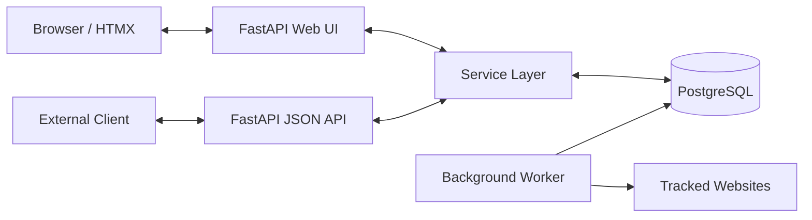

# Website Change Monitor

Website Monitor is a full-stack application for tracking changes on public web pages.

Users can add URLs to monitor, browse saved content snapshots, archive pages to pause scheduled checks, and reactivate them when monitoring should resume. A separate background worker periodically fetches active pages and stores a new snapshot only when the extracted page content has changed.

## Features

- **User Authentication:** Registration and JWT-based authentication.
- **Track URLs:** Add public URLs for monitoring with duplicate URL validation.
- **Background Scraper:** Scheduled checks performed by a dedicated worker using HTTP connection pooling and concurrency limits.
- **Smart Snapshots:** Automatic page-title extraction and SHA-256 content hashing to avoid saving duplicate data.
- **Visual Diffs:** Beautiful, dynamic UI highlighting added and removed content between snapshots.
- **History Browsing:** Snapshot history displayed in a modal with Previous and Next navigation.
- **Pause/Resume:** Archive pages to stop scheduled checks and reactivate them to resume.
- **Automatic Tracking:** Updates `last_checked_at` and `last_changed_at` automatically.
- **Clean API:** Strict separation between the HTMX-driven Web UI layer and the pure JSON REST API.
- **CI/CD:** Fully automated testing and linting via GitHub Actions.

- **JavaScript Rendering:** Uses Playwright to automatically detect and fully render JavaScript-heavy websites (SPAs) while falling back to lightning-fast HTTPX for static pages to conserve memory.

## Architecture

The project uses a layered architecture with clear separation between the UI, API, Service, and Data Access layers.

- **Web UI (`/web`):** Handled by FastAPI returning Jinja2 templates and interacting seamlessly with HTMX for dynamic partial page updates without full reloads.
- **REST API (`/api/v1`):** Pure JSON endpoints designed for potential mobile apps or external integrations.
- **Service Layer:** Centralizes business logic. The Unit of Work pattern is implemented using SQLAlchemy's async session (`async_sessionmaker`), ensuring robust database connection handling, especially for concurrent background tasks.
- **Worker Concurrency:** The background worker (`APScheduler`) spawns concurrent tasks to check websites asynchronously using `httpx.AsyncClient` pooling and an `asyncio.Semaphore` to gracefully limit memory and DB connection usage.



### Docker services

| Service | Responsibility |
|---|---|
| `db` | PostgreSQL database for users, tracked pages, and snapshots |
| `api` | FastAPI application serving Jinja2 pages and REST API endpoints |
| `worker` | APScheduler process that fetches active pages and creates snapshots |

## Tech stack

- **Backend:** Python 3.12, FastAPI, SQLAlchemy Async ORM, PostgreSQL, Alembic, APScheduler, HTTPX, BeautifulSoup4, Pydantic
- **Frontend:** Jinja2 templates, HTMX, Tailwind CSS, daisyUI, Lucide icons
- **Infrastructure:** Docker, Docker Compose, `uv` (Python package manager)
- **CI/CD:** GitHub Actions, Pytest, Ruff

---

## Prerequisites

To run and develop this project locally, you need the following tools installed on your machine:
1. **[Git](https://git-scm.com/downloads)** - For version control.
2. **[Docker](https://docs.docker.com/get-docker/)** - To run the application containers.
3. **[Docker Compose](https://docs.docker.com/compose/install/)** - To orchestrate the API, Worker, and Database.

## Run locally

### 1. Clone the repository

```bash
git clone https://github.com/maksymminullin/website-change-monitor.git
cd website-change-monitor
```

### 2. Configure environment variables

Create the local development environment file from the template:

```bash
cp .env.example .env
```
*(Update values in `.env` if needed, but defaults work out of the box for local development).*

### 3. Start the application

Start all services (Database, API, Worker) in detached mode:

```bash
docker compose up -d --build
```

### 4. Apply database migrations

Set up the database tables by running Alembic inside the API container:

```bash
docker compose exec api alembic upgrade head
```

### 5. Open the app

The application is now running. Open your browser and navigate to:
**http://localhost:8000**

---

## Useful Commands (Logs, DB, etc.)

**View all logs in real-time:**
```bash
docker compose logs --tail=100 -f
```

**View logs for a specific service:**
```bash
docker compose logs --tail=100 -f api
docker compose logs --tail=100 -f worker
docker compose logs --tail=100 -f db
```

**Stop the application:**
```bash
docker compose down
```

**Create a new database migration:**
```bash
docker compose exec api alembic revision --autogenerate -m "describe change"
```

**Open a PostgreSQL shell:**
```bash
docker compose exec db psql -U "$POSTGRES_USER" -d "$POSTGRES_DB"
```

---

## Testing & CI/CD

This project uses **Pytest** for testing and **GitHub Actions** for Continuous Integration. Every push to the `main` branch triggers the CI pipeline which:
1. Lints and formats the code using `ruff`.
2. Spins up a temporary PostgreSQL service container.
3. Runs the full test suite (`pytest`) against the database to ensure no API or worker logic is broken.

### Running tests locally

To run tests locally, you need to use the local Python virtual environment managed by `uv` and ensure the test database is running on port 5433 (which is mapped in `docker-compose.yml`).

Create the test `.env` file:
```bash
cp .env.test.example .env.test
```

Start the local database via Docker:
```bash
docker compose up -d db
```

Create the test database inside the container (only needed once):
```bash
docker compose exec db psql -U postgres -d postgres -c "CREATE DATABASE monitor_test_db;"
```

Run tests using `uv`:
```bash
uv run pytest
```

Run linting:
```bash
uv run ruff check .
uv run ruff format .
```

## Limitations & Future Plans

- **Scalability:** The current `APScheduler` implementation runs entirely in a single container. For highly scaled workloads, this should be decoupled into a distributed queue system like Celery or RQ backed by Redis.
